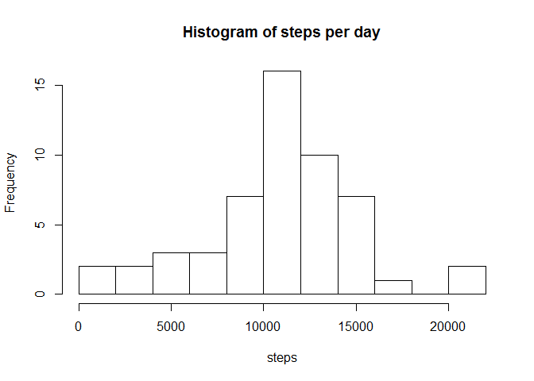
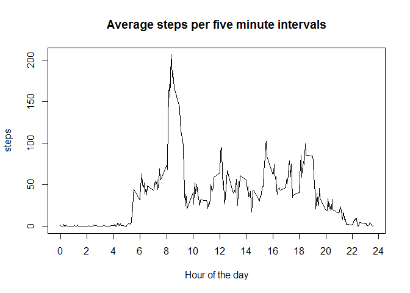
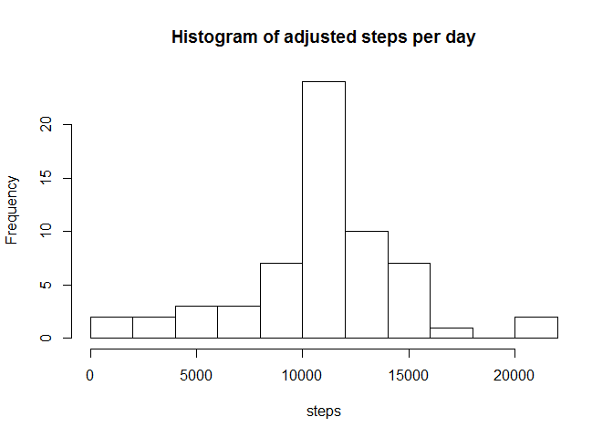
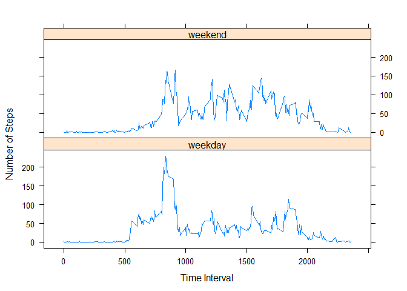

# Reproducible Research: Peer Assessment 1


## Loading and preprocessing the data


```r
url <- "http://d396qusza40orc.cloudfront.net/repdata%2Fdata%2Factivity.zip"
```

Data for this project comes from http://d396qusza40orc.cloudfront.net/repdata%2Fdata%2Factivity.zip

Download the data, and capture and report metadata


```r
zipFile <-"activity.zip"
dataFile <- "activity.csv"
dataInfoFile <- "dataSourceInformation.csv"

    #Lectures say to download data from the original source. The assigment says
    #to use the data in the repo. I am going with what the assignement says,
    #however, if one were to follow the lectures, uncomment the next line.
#download.file(url,zipFile)
zipInfo <- unzip(zipFile,list=TRUE)
    #Expecting a single csv file, abort if that is not the case
stopifnot(nrow(zipInfo)==1)
stopifnot(zipInfo[1,"Name"]==dataFile)
    #extract the data file, and confirm it is what we are expecting.
unzip(zipFile)
stopifnot(file.exists(dataFile))
    #Create record of data source. Again, good practice per lectures, but not
    #part of the assignement.
    #todo: structure this as rows instead of columns. Time permitting.
write.csv( data.frame(
                Source=url
              , Download_Date = as.POSIXlt(file.mtime(zipFile),"UTC")
              , File_Date = zipInfo[1,"Date"])
        , file = dataInfoFile
        , row.names = FALSE )
print(read.csv( dataInfoFile ))
```

```
##                                                               Source
## 1 http://d396qusza40orc.cloudfront.net/repdata%2Fdata%2Factivity.zip
##         Download_Date           File_Date
## 1 2015-09-12 20:52:34 2014-02-11 10:08:00
```

```r
activity <- read.csv(dataFile)
```


## What is mean total number of steps taken per day?


```r
steps<-aggregate(steps ~ date, activity, sum)[,2]
meanSteps <- mean(steps)
medianSteps <- median(steps)
```

Steps Per Day

- Mean:   10766.19  
- Median:  10765.00


```r
hist(steps,breaks=10,main="Histogram of steps per day")
```

 


## What is the average daily activity pattern?


```r
    # Get steps averaged by time interval
steps <- aggregate(steps ~ interval, activity, mean, rm.na=TRUE)
    # Make time more readable. Use 24 hour hh:mm format.
steps$time <- sprintf("%02d:%02d", steps$interval / 100, steps$interval %% 100)
    # sort by steps and extract the top ten.
topStepTimes <- steps[order(0.0-steps$steps),3:2][1:10,]
```

The time interval with most steps is 08:35, with an average of 206.1698113 steps per day.

All of the top ten intervals with the most average steps were near this time.


```r
print(topStepTimes, row.names = FALSE)
```

```
##   time    steps
##  08:35 206.1698
##  08:40 195.9245
##  08:50 183.3962
##  08:45 179.5660
##  08:30 177.3019
##  08:20 171.1509
##  08:55 167.0189
##  08:15 157.5283
##  08:25 155.3962
##  09:00 143.4528
```

The step distribution throughout the day is shown in this graph


```r
plot(steps[,1:2]
     , type="l"
     , main="Average steps per five minute intervals"
     , xlab="Hour of the day"
     , xaxt="n")
    # Replace the time format used in the dataset by the hour of the day on the x axis.
    # Put ticks for even numbered hours
axis(1, at=0:12*200, labels=0:12*2)
```

 


## Imputing missing values

```r
naCount <- sum(is.na(activity$steps))
naPercent <- 100 * naCount / nrow(activity)
```

The source data has 2304 missing data points. This represents 13.11% of the values

We are going to replace the missing data points with the average for that time interval across all days.


```r
    #compute mean steps by interval
meanStepsByInterval <- aggregate(steps ~ interval, activity, mean, rm.na=TRUE)
names(meanStepsByInterval) <- c("interval", "mean")
    #add a column for the mean
adjustedData <- merge(activity,meanStepsByInterval,by.x="interval",by.y="interval")
    #add a column, if na then use the mean, otherwise the actual step count
adjustedData$steps.adjusted <- ifelse(is.na(adjustedData$steps), adjustedData$mean, adjustedData$steps)
```

The first few rows of the imputted dataset

```r
adjustedData[1:5,]
```

```
##   interval steps       date     mean steps.adjusted
## 1        0    NA 2012-10-01 1.716981       1.716981
## 2        0     0 2012-11-23 1.716981       0.000000
## 3        0     0 2012-10-28 1.716981       0.000000
## 4        0     0 2012-11-06 1.716981       0.000000
## 5        0     0 2012-11-24 1.716981       0.000000
```


```r
    #sum by dates, then drop down to a single column of steps.
steps<-aggregate(steps.adjusted ~ date, adjustedData, sum)[,2]
meanSteps2 <- mean(steps)
medianSteps2 <- median(steps)
```

Steps Per Day

- Mean:   10766.19  
- Median:  10766.19


```r
meanDif <- 100 * (meanSteps2 - meanSteps) / meanSteps
medianDif <- 100 * (medianSteps2 - medianSteps) / medianSteps
```

These values differ from the original values by 0.00% and 
0.01% respectively


```r
hist(steps,breaks=10,main="Histogram of adjusted steps per day")
```

 


## Are there differences in activity patterns between weekdays and weekends?

Columns for the "dayOfWeek" and "weekend" are added to the data set.


```r
adjustedData$dayOfWeek <- weekdays(as.POSIXlt(adjustedData$date))
adjustedData$weekend <- ifelse(adjustedData$dayOfWeek == "Saturday" | adjustedData$dayOfWeek == "Sunday"
                                 , "weekend", "weekday")
```

Then an aggregate dataset is generate around interval and weekend


```r
steps<-aggregate(steps.adjusted ~ interval + weekend, adjustedData, mean)
```

The lattice package is used to generate the plot


```r
    #Install lattice, if necessary
if( ! exists("xyplot") ) {
    if( ! is.element( "lattice", installed.packages())) {
        install.packages("lattice")
    }
    library(lattice)
}
```

```
## Warning: package 'lattice' was built under R version 3.2.2
```

```r
    #generate the plot
xyplot( steps.adjusted ~ interval | weekend
        , data=steps
        , layout = c(1,2)
        , panel="panel.lines"
        , xlab="Time Interval"
        , ylab = "Number of Steps" )
```

 

